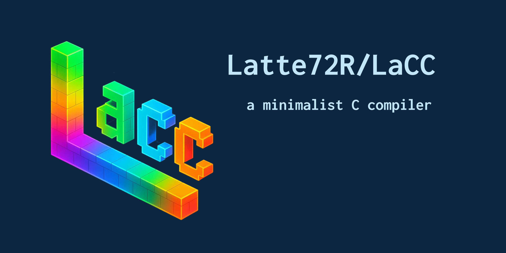

[English](README.md) | 日本語



LaCC は, C コンパイラの仕様やメモリ構造の理解を目的に開発された, 必要最小限の機能だけを備えたシンプルな C コンパイラです. 

[![DeepWiki](https://img.shields.io/badge/DeepWiki-Latte72R%2FLaCC-blue.svg?logo=data:image/png;base64,iVBORw0KGgoAAAANSUhEUgAAACwAAAAyCAYAAAAnWDnqAAAAAXNSR0IArs4c6QAAA05JREFUaEPtmUtyEzEQhtWTQyQLHNak2AB7ZnyXZMEjXMGeK/AIi+QuHrMnbChYY7MIh8g01fJoopFb0uhhEqqcbWTp06/uv1saEDv4O3n3dV60RfP947Mm9/SQc0ICFQgzfc4CYZoTPAswgSJCCUJUnAAoRHOAUOcATwbmVLWdGoH//PB8mnKqScAhsD0kYP3j/Yt5LPQe2KvcXmGvRHcDnpxfL2zOYJ1mFwrryWTz0advv1Ut4CJgf5uhDuDj5eUcAUoahrdY/56ebRWeraTjMt/00Sh3UDtjgHtQNHwcRGOC98BJEAEymycmYcWwOprTgcB6VZ5JK5TAJ+fXGLBm3FDAmn6oPPjR4rKCAoJCal2eAiQp2x0vxTPB3ALO2CRkwmDy5WohzBDwSEFKRwPbknEggCPB/imwrycgxX2NzoMCHhPkDwqYMr9tRcP5qNrMZHkVnOjRMWwLCcr8ohBVb1OMjxLwGCvjTikrsBOiA6fNyCrm8V1rP93iVPpwaE+gO0SsWmPiXB+jikdf6SizrT5qKasx5j8ABbHpFTx+vFXp9EnYQmLx02h1QTTrl6eDqxLnGjporxl3NL3agEvXdT0WmEost648sQOYAeJS9Q7bfUVoMGnjo4AZdUMQku50McDcMWcBPvr0SzbTAFDfvJqwLzgxwATnCgnp4wDl6Aa+Ax283gghmj+vj7feE2KBBRMW3FzOpLOADl0Isb5587h/U4gGvkt5v60Z1VLG8BhYjbzRwyQZemwAd6cCR5/XFWLYZRIMpX39AR0tjaGGiGzLVyhse5C9RKC6ai42ppWPKiBagOvaYk8lO7DajerabOZP46Lby5wKjw1HCRx7p9sVMOWGzb/vA1hwiWc6jm3MvQDTogQkiqIhJV0nBQBTU+3okKCFDy9WwferkHjtxib7t3xIUQtHxnIwtx4mpg26/HfwVNVDb4oI9RHmx5WGelRVlrtiw43zboCLaxv46AZeB3IlTkwouebTr1y2NjSpHz68WNFjHvupy3q8TFn3Hos2IAk4Ju5dCo8B3wP7VPr/FGaKiG+T+v+TQqIrOqMTL1VdWV1DdmcbO8KXBz6esmYWYKPwDL5b5FA1a0hwapHiom0r/cKaoqr+27/XcrS5UwSMbQAAAABJRU5ErkJggg==)](https://deepwiki.com/Latte72R/LaCC) [![GitHub License](https://img.shields.io/badge/License-MIT-green.svg?logo=data:image/png;base64,iVBORw0KGgoAAAANSUhEUgAAACAAAAAgCAYAAABzenr0AAAABGdBTUEAALGPC/xhBQAAACBjSFJNAAB6JgAAgIQAAPoAAACA6AAAdTAAAOpgAAA6mAAAF3CculE8AAAABmJLR0QA/wD/AP+gvaeTAAAAB3RJTUUH6QUSEzgc0pENEwAAB+tJREFUWMPdV3uMXFUd/n7nnHvvzOy8d2dmZ1sUKI+ybUEsYnkoYAgoBYIxIQWppiaiMRKN/6mQGBNN+EvFNESjYgRDiI8EigaUUhQLxQLdQtndlkf31cfM3tnH3LmPuY/z849paZdSCoW//JKbe2/OPd/vO7/XPYfwEeJrmzYBAAkSaNgNEBEA8GOPbvkozXy0oNOZ9Mabb2Fy+hCtHj6nSgAmDxxsDpRKfNaZZ55y7mWXrzveLqvTEdBfLqJQyKXT6dRPwDCW1WrfNk3DOR2u0xJgGAaUUqaU8jzWnCKCJYR4XwKef24HAPAHFjB9YAbdblcW8vlqkiQrhRSrCDQEgpHNZr/MzHtaLXvcaTsNwzTiZcuWvy/eJTmwZ/Q1JFpT2rKUkoqEFLAsSyqlsoahViqprhdCXEdEHwdBCBJ5gElrXgTAzDyttd6aJMkTURS9FsdJO+gGOo4TTuKY/cCPhZR84eo1Jwr45eb7cefXN6HjuGsty7yTiFIAmIgyIHyMQGcB0FrrHVrrp7TWM5Zl/YiZzSAI7pZS1qSU1wpBlwFkMvMkgAlm7gAgzRyEYfjrXDb70m9+93t865vfWBqCer0OAoEIBSHESiHEahDKrHlSs35Va/1EFEVP+X6wu16vOx23UwTQZuZ0t9t9tlgs2rbderCvL7NGKXWtEOISIcTFUsqzNet5aP0qAUUhBGq16rvHY2JyAs+/sEO2WvYa3/dGgq7Prtt56OChg/3bnnlG7N23FwDQdtqYm2+VgsD/t+d5/z3cOFyZm5sDAOwa2Y3fPvAHmpmZKXVc54Fu12fPc3fb9uyFL764U05NTZ68CpQysO7STyedjnMFgGocJ89JIS7PpDPnXrL2kztyuXwvbkQgiHddxMWfuAhtp81a6xVSyCviOH5OCLnCtMwr1q695JWpqekl3y9h6evLwG7ZQ1LKjVrrF3zf/yEArQx5R6PZNJvNxonp+477rD0Lu9UylJK3M5h9P/iB1vpFKdVG254dyuWz7y5gamoKxUIRlmWuJ6Jz4zj+486Xdz2bJMkWKeT6/nL5or6+Pqy4cA3eC5ZpolQsrhJC3qQT/fj27c//J4qih4hwrpWybigVS5ianjpRQC6XhW3bg0qqjVrrXZ7nbbty3bokDKOHGSDDNG9v2rax4+mn32GS3743m00cPHRYGUptAGBEcfzINZ+7OvF8/ynWPKJ6XqjlstmlAianplAslmBZ1ueJ6IIkSR4aHKy3XM/F3Pz8iE6Sv0shbi4WCqst0wQtaSBHnphgWSaqlcpKIeUXtdZPthcXd3uuh/pg3Y7i+A9ENGxZ1vXFYgn7J/YfE5DPZ2HbsxWl5EZm3uP5/pPz83OoD9ZRrVTCOI4fBGAYhrGh0WioJEmO9dJeVoLBeGv/hDRM41YCMnEUPVgql7uDg4NotWy4rvuE1nq3UuorjWajks/3Elq15loIw6icyWS+I4RYl2i9PZvN3kFEcD23p1KLFABfSnlbrVZ7ZX5h4ZF8Pr9Eg+t66uyzz7pVSbkRQFcZxlVEdKnr9jhSqTQAxEKIKzOZzF2e5/3Mbtnz1HYWkST6mlQq9Wf02unicb5lAAQGE4GIqKa13uM4zo2WZYWpVGqLZk61284Ngkhms32PCyGGmbnBx5LjKM/REi6CWQdBcIuUcrsCA2BeBHMQx/FjnuffJ6QAHRdlBhjM2b6+zM8BeInWAQB5lP3IxicA4CRJsst13e8KIToAEYOPcDESrZHJZL6npLyOwW0GIKI4RrcbvsnMLyulLjNNgwr5/Nj+yYmxgYGBMa312EB//7iVspaTECu01lvrg/V3/nqpUqkuaq23CinOSaXTy/v7B8aTJBmrDFTGDjUOjxWKxTHTMJWScp3Weqfn+RNhGEIszC+iVqstRlG0GUDZsqxfeL7/mTOWL8/NHJixiKjf6Ti3GUrdy1qPB93uI22nDQbT0SJkAIuLCwij6GHWvM9Q6l6n49wmpOg/ePCAVa1U8q7rXm1Z5n0AcmEU3b9saJkz27R7fm42G3A6HTUwMPAlw1D3EKjAzHsYWCBgORGdz8wj3TD8frFQfMnptJEkupROpR7t5UB7vWEYs+VSGQuLC58yTfOngugiBvaCeQZAPxGtYua5KIp+PD0z89f+cjmp14d6ZVit1qCUisfHxv8U+MGGOI5/xcwhAVVmnoni+J6O624qFoov7X39DQgSoLf7Ty/dCMD4vn0oFoo7Xdf9ahRFd7PW0wyuMLMbx/Fm3w82vDo6+pdsLpfU60NLOvnbGB0dhef5YmionjYMJYNuGB5uNrp9mQwPr7wAANDpOIijqJRKpx/VWqfabWe9aRqz5XI/AOC1sVF4vk+1SsVKWSkziqN4cnI6yOWyes3q1UvsnbAlGx4eBgANwD1ZvyciSKX4ZOOrLhg+mh7BkeukOOWecN8br0NrTSnLMohIgBmHGg0u5PIpwzAEAMGsrfnFBWticpJAgE4SHQRBJKTkleed/57873kuuPjSy/Hstn8gDMNVpmneRUARR5sKkSmF+CwAmSTJv45bKTGzE0bRZss0R/65dRtuufmm0/eAoRSiMDpDCPEFIsoDR+qvBw0gkVJedSweTMzsUkx/My1z5FT8pzwZNZtNaK37TNM4r7dRJT6uSR/xx7EX7nmgG4XRPiFEp1qtfjgBHxY33Xzj8XZ4y2OPLxkXH5Tw/w7/A3fL7I2rzj4yAAAAJXRFWHRkYXRlOmNyZWF0ZQAyMDI1LTA1LTE4VDE5OjU1OjIyKzAwOjAw1XTSSAAAACV0RVh0ZGF0ZTptb2RpZnkAMjAyNS0wNS0xOFQxOTo1NToyMiswMDowMKQpavQAAAAASUVORK5CYII=)](https://github.com/Latte72R/LaCC/blob/main/LICENSE)


## サポートされている機能

### 1. データ型

- **プリミティブ型**: `int`, `char`, `void`, `unsigned`, `long`, `long long`, `short`, `_Bool`
- **派生型**: ポインタ (`T*`), 配列 (`T[]`)
- **複合型**: 構造体 (`struct`), 共用体 (`union`), 列挙体 (`enum`)

#### float/double の扱い

ヘッダ互換性のために `float` と `double` を「擬似的に」サポートしています. 

- トークナイズとパースはできますが、数値演算や比較、コード生成は未実装です. 
- `sizeof(float)` は 4、`sizeof(double)` は 8 として扱います（LP64 前提）.   
  `long double` も簡易的に 8 バイトとして扱います. 
- `typedef float _Float32;` や `typedef double _Float64;` といったヘッダ内の型定義は通りますが、これらの型での演算は未サポートです. 

(将来的に `TY_FLOAT`/`TY_DOUBLE` の導入と算術・ABI 対応を段階的に実装する予定です.) 


### 2. 関数

- **定義:**  
  パラメータと戻り値の型を指定できます. 
- **宣言と呼び出し:**  
  関数の定義, 呼び出し, `return` での値を返却が可能です. 

### 3. グローバル＆ローカル変数

グローバル変数とローカル（スタック上）変数の宣言がサポートされています. 

### 4. 制御構造

- **条件分岐**

  - `if (condition) { … }`
  - `else { … }`
- **ループ**

  - `do { … } while (condition);`
- **ループ制御**

  - `continue`
### 5. 演算子

- **算術**: `+`, `-`, `*`, `/`, `%`
- **比較**: `==`, `!=`, `<`, `<=`, `>`, `>=`
- **論理**: `&&`, `||`, `!`
- **ビット演算**: `&`, `|`, `^`, `~`, `<<`, `>>`

### 6. その他
- **インクルード指令**
  ダブルクォート形式の `#include "foo.h"` と山括弧形式の `#include <bar.h>` を処理できます.  
  ダブルクォートはインクルード元のファイルと同じディレクトリを優先し, 山括弧は登録済みのインクルードパスを探索します.  

- **プリプロセッサマクロ**
  オブジェクト形式および関数形式の `#define`（文字列化 `#`・トークン連結 `##` を含む）をトークナイズ時に展開します.

- **条件付きコンパイルディレクティブ**  

- **組み込み済みマクロ**  
  `__LACC__`, `__x86_64__`, `__LP64__` を自動的に `1` として定義し, Unix 系ヘッダが環境を判別しやすいようにしています.

- **配列と構造体の初期化リスト**（制限あり）

  ```c
  // 文字配列への文字列リテラル初期化:
  char str[15] = "Hello, World!\n";
  int arr[3] = {3, 6, 2};
  struct AB v = {.a = 1, .b = 2};
  ```

  初期化式は整数定数（または `char[]` への文字列リテラル）に限られます。
  多段にネストした配列の初期化は未対応です。

- **extern 宣言**
  基本型, ポインタ, 配列などの外部変数宣言が可能です. 
- **typedef サポート**
  型エイリアスを作る `typedef` が使えます. 
- **型修飾子およびストレージクラス指定子:** 
  `const`, `volatile`, `static`, `signed`, `unsigned``
- **`goto` とラベル:**  
  `goto` 文とラベル定義をサポートし、非線形な制御フローが可能です.

- **構造体と共用体のメンバアクセス**
  ドット (`.`) とアロー (`->`) の両方に対応しています. 

- **2進数・16進数リテラル**
  例） `0b001011`,  `0xFF2A`

- **コメント**
  ```c
  // 1行コメント
  /* 
     複数行コメント 
  ```
  
  `switch` 文と `case` / `default` ラベルをサポートし、値に基づく分岐が可能です.

  互換性のある型同士での明示的な型キャストをサポートしています.

  LaCC は三項演算子 (`?:`) をサポートし、インライン条件式を記述できます.


以下の機能には対応していません. 
- `float`, `double` などの浮動小数点型
- 初期化リストでの複雑な式や多段のネスト
- `register`, `auto` などの一部の型修飾子・ストレージ指定子
- インラインアセンブリ
- 可変長引数関数 (`...`) の定義
  - `va_list`, `va_start`, `va_arg` などのマクロはサポートされていません.
- ネストした関数定義
- 可変長配列 (VLA)


### 単一ユニットコンパイル
一度に扱えるのは単一の `.c` ファイルのみで, 複数ファイルの同時コンパイルには対応していません.   
それぞれの `.c` ファイルを LaCC によりコンパイルした後に,  `clang` や `gcc` によってリンクしてください. 
### 最適化
コード生成における最適化は一切行われません. 

## 使用方法

### 1. リポジトリをクローンしてディレクトリに移動する

  ```bash
  git clone https://github.com/Latte72R/LaCC
  cd LaCC
  ```

  この操作では、リポジトリをローカルに複製し、作業ディレクトリを `LaCC` に変更します.   
  これにより、コンパイラをビルドしてテストするためのいくつかの `make` ターゲットが利用可能になります. 

### 2. セルフホストコンパイラをビルドする

  ```bash
  make selfhost
  ```

  この操作では、`bootstrap`（ブーストラップコンパイラ）を使ってソースコードを再コンパイルし、
  `lacc`（セルフホストコンパイラ）を生成します.   
  これにより、コンパイラのソースコード自体を正しくコンパイルできることを確認できます. 

### 3. セルフホストコンパイラでプログラムを実行する

  ```bash
  make run FILE=./examples/lifegame.c
  make run FILE=./examples/rotate.c
  ```

  これらのコマンドを実行することで、`lacc` を使って指定した C 言語のプログラムをコンパイルし実行できます. 

### 4. セルフホストコンパイラのユニットテストを実行する

  ```bash
  make unittest
  ```

  すべてのテストが通れば、セルフホストコンパイラの動作が期待どおりであることが確認できます.   
  ユニットテストは `tests/unittest.c` にあります.   

### 5. セルフホストコンパイラの警告テストを実行する

  ```bash
  make warntest
  ```
  このコマンドは警告テストを実行し、コンパイラが警告を正しく特定し報告できることを確認します.   
  警告テストは `tests/warntest.c` にあります.   

### 6. セルフホストコンパイラのエラーテストを実行する

  ```bash
  make errortest
  ```
  このコマンドはエラーテストを実行し、コンパイラがエラーを正しく特定し報告できることを確認します.   
  エラーテストは `tests/errortest.sh` にあります.   

### 7. ビルド成果物をクリーンアップする

  ```bash
  make clean
  ```

  このコマンドを実行することで、ビルド時に生成したバイナリやアセンブリファイルなどをすべて削除できます. 

### 8. ヘルプを表示する

  ```bash
  make help
  ```

  利用可能な make ターゲットとその説明のリストを表示します. 

## 作者について

LaCC は学生エンジニア **Latte72** が設計・開発しています！

### リンク

- **Web サイト:** [https://latte72.net/](https://latte72.net/)
- **GitHub:** [@Latte72R](https://github.com/latte72r)
- **X (a.k.a Twitter):** [@Latte72R](https://twitter.com/Latte72R)
- **Qiita:** [@Latte72R](https://qiita.com/latte72r)
